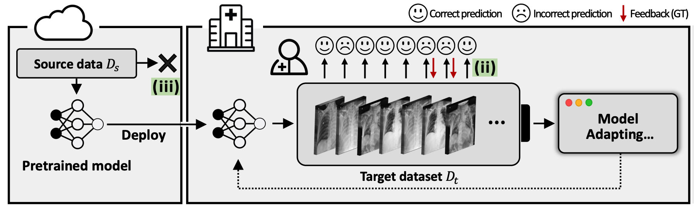

# NBF & RLD with Chest X-ray

<div align="center">
  
  <div>&nbsp;</div>

[](https://arxiv.org/abs/2407.15383) [](https://sites.google.com/view/junha/nbf-rld)
</div>


## Description

To conduct medical experiments, we present a practical medical setting. We adopt the MIMIC-CXR-V2 dataset. It assumes a multi-finding binary classification setup, where multiple radiographic findings, like Pneumonia and Atelectasis, can coexist in a single chest X-ray (CXR) sample. Thus, the model predicts the presence or absence (binary classes) of each individual finding. We simulate domain shift by using Posterior-Anterior (PA)-view data as the source and AP-view data as the target, capturing real-world variations in data acquisition. Typically, patients requiring an AP X-ray are those facing positioning challenges that prevent them from undergoing a PA X-ray. Therefore, this setup can be seen as a scenario where the target environment is the intensive care unit, which hospitalizes critically ill patients.

## Installation

Install the required packages using the provided `requirements.txt`:
```bash
pip install -r requirements.txt
```

If you encounter any issues with the installation, you may try using the requirements from [torchxrayvision](https://github.com/mlmed/torchxrayvision) repository as an alternative.

We recommend using the same Docker environment as the authors.
```bash
docker pull pytorch/pytorch:1.12.1-cuda11.3-cudnn8-runtime
```

## Dataset Preparation

The MIMIC-CXR-V2 dataset contains chest X-ray images and reports from Beth Israel Deaconess Medical Center. Due to patient privacy concerns, we cannot directly provide the dataset. To access the dataset:

1. Complete the required CITI training
2. Sign the data use agreement on PhysioNet
3. Request access through the PhysioNet platform (https://physionet.org/content/mimic-cxr/2.0.0/)
4. Once approved, download the dataset using the provided credentials

### Image Preprocessing
The original images in MIMIC-CXR-V2 are high resolution, which can lead to longer training times. We recommend resizing the images to 224x224 pixels using our preprocessing script:

```bash
python mimics_to_224.py --root_folder files
```

Where `--root_folder` should point to your MIMIC-JPG image directory (e.g., `files`). This preprocessing step will significantly reduce training time while maintaining sufficient image quality for most deep learning applications.

### Directory Structure

After preprocessing, your data directory should have the following structure:

```bash
RLD-SemiSDA/chest-X-ray/data/mimic/
├── LICENSE.txt
├── README
├── SHA256SUMS.txt
├── files/
├── files_224/                         # Preprocessed 224x224 images
├── mimic-cxr-2.0.0-chexpert.csv       # CheXpert labels
├── mimic-cxr-2.0.0-chexpert.csv.gz
├── mimic-cxr-2.0.0-metadata.csv       # Metadata information
├── mimic-cxr-2.0.0-metadata.csv.gz
├── mimic-cxr-2.0.0-negbio.csv         # NegBio labels
├── mimic-cxr-2.0.0-negbio.csv.gz
├── mimic-cxr-2.0.0-split.csv          # Train/val/test splits
├── mimic-cxr-2.0.0-split.csv.gz
└── mimic-metas.zip
```

## Pretraining

The source model pretraining was conducted using 4 NVIDIA Titan-XP GPUs. To start the pretraining process, simply run:

```bash
python train.py
```

#### Training Configuration

The default configuration uses the following key settings:
- Batch size: 32 per GPU (total effective batch size of 128)
- Data augmentation:
  - Rotation: up to 45 degrees
  - Translation: 15% of image size
  - Scale: 15% variation
- Model: DenseNet121
- Learning rate: 0.004
- Source domain: PA view (specified by `--src PA`)

The full configuration can be found in the `get_cfg()` function, which provides numerous customizable parameters. You can modify any of these parameters by passing them as command-line arguments:

```bash
python train.py --batch_size 32 # Example of custom parameters
```

#### Output

After training is complete, the source model will be saved in the outputs directory with the following structure:
```bash
Chest-X-ray/outputs/mimic-densenet121-04PA_ddp2/
```

#### Using Pre-trained Models

For convenience, we provide our pretrained source model. You can download the model from our [Google Drive](https://drive.google.com/drive/folders/11mzE1szNK-3ErtKlv0kUPQbJTAQgoBmx?usp=sharing).

To use the pretrained model, follow these steps:
1. Download `densenet-best.pt` from the provided link
2. Create the output directory if it doesn't exist:
   ```bash
   mkdir -p outputs/mimic-densenet121-04PA_ddp2/
   ```
3. Place `densenet-best.pt` in the `outputs/mimic-densenet121-04PA_ddp2/` directory

Once the pretrained model is in place, you can skip the pretraining step and proceed directly to the adaptation phase.

## Adaptation

For reproducibility, the train and validation indices used for the AP set are provided in our [Google Drive](https://drive.google.com/drive/folders/11mzE1szNK-3ErtKlv0kUPQbJTAQgoBmx?usp=sharing). Place these indices in `Chest-X-ray/data/mimic/train_val_indices/`.

We provide two different adaptation scenarios:

#### 1. Random Feedback
To run adaptation with random feedback strategy:
```bash
python adapt.py --label_select_strategy random_feedback --ulb_ratio 7
```

#### 2. Negatively Biased Feedback
To run adaptation with negatively biased feedback strategy using RLD:
```bash
python adapt.py --label_select_strategy negatively_biased_feedback --use_rld --ulb_ratio 4 --rld_num_append 3
```

Note: The `ulb_ratio` parameter follows the convention from [Semi-supervised Learning by Microsoft](https://github.com/microsoft/Semi-supervised-learning).


## Acknowledgement

This project's medical image processing pipeline is built upon [torchxrayvision](https://github.com/mlmed/torchxrayvision).


## Citation

If you find this work interesting and useful, please cite our paper:

```bibtex
@inproceedings{song2024nbfrld,
  title={Is user feedback always informative? Retrieval Latent Defending for Semi-Supervised Domain Adaptation without Source Data},
  author={Junha Song and Tae Soo Kim and Junha Kim and Gunhee Nam and Thijs Kooi and Jaegul Choo},
  booktitle={The European Conference on Computer Vision (ECCV)},
  year={2024}
}
```
