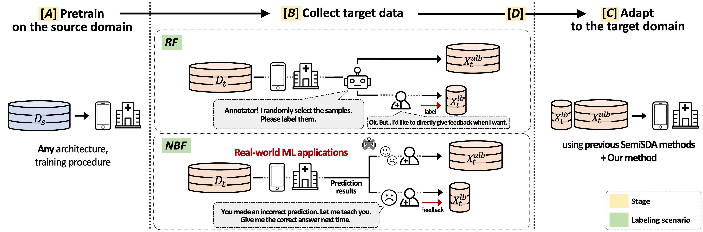

# NBF & RLD with Image Classification

<div align="center">
  
  <div>&nbsp;</div>

[](https://arxiv.org/abs/2407.15383) [](https://sites.google.com/view/junha/nbf-rld)
</div>

## Research Motive

💁‍♂️: Have you heard about semi-supervised domain adaptation (SemiSDA)? It's an interesting approach where we adapt the source model to the target environment using both <u>labeled</u> and unlabeled target data.  
🙋‍♀️: That sounds intriguing. But I'm curious, how do we collect <u>labeled</u> data in target devices like smartphones or medical applications?  
🙍‍♂️: One way could be to collect small amounts of <u>feedback from users</u>.  
💁‍♀️: Um... I've been thinking about user feedback actually. You know, from a psychological perspective, users tend to be more likely to provide feedback on data points where the model makes <u>incorrect predictions</u>. Have you considered this angle?  
🤦‍♂️: No. Previous works also hadn't considered that before. That's an interesting observation! [🔬 conducting some experiments...]   
🤷‍♂️: I've been looking into existing SemiSDA methods, and I've noticed they often yield suboptimal results in the scenario.

## User feedback

User feedback. Feedback given by users is modeled as annotations ${y_{lb}^n : n \in [1.. N_{lb}]}$ on a small subset of the target's training set $D_t^{train}$, while the remaining of them are used as unlabeled target data. In our experiments, we take into account two types of feedback: random feedback (**RF**) and negatively biased feedback (**NBF**). RF is the same setup of classical SemiSDA and SemiSL, where randomly selected samples from $D_t^{train}$ are used as small labeled set $X_t^{lb}$. For NBF, we randomly select samples that are incorrectly predicted in $D_t^{train}$ by the source model (i.e., the pre-trained model before adaptation). Note that we focus on the impact of a biased label distribution within the same class, and thus take the same number of feedback for each class.

## Installation

Install the required packages using the provided `requirements.txt`:
```bash
pip install -r requirements.txt
```

If you encounter any issues with the installation, you may try using the requirements from [USB/Semi-supervised-learning](https://github.com/microsoft/Semi-supervised-learning) repository as an alternative.

We recommend using the same Docker environment as the authors.
```bash
docker pull pytorch/pytorch:1.12.1-cuda11.3-cudnn8-runtime
```

## Dataset Preparation

We use two popular domain adaptation datasets: Office-Home and DomainNet. Below are the instructions for downloading and organizing these datasets.

### Office-Home Dataset

1. Download the Office-Home dataset from [here](https://www.hemanthdv.org/officeHomeDataset.html)
2. Extract and organize the dataset in the following structure:
```bash
${DATA_ROOT}
├── office-home
│   ├── Art
│   ├── Clipart
│   ├── Product
│   ├── `Real World`
│   ├── Art.txt
│   ├── Clipart.txt
│   ├── Product.txt
│   ├── Real_World.txt
```

### DomainNet Dataset

Following [MME](https://arxiv.org/abs/1904.06487) and [Guiding-PL](https://arxiv.org/abs/2303.03770), we use a subset of it that contains 126 classes from 4 domains (Real, Sketch, Clipart, Painting).

1. Download the DomainNet dataset from [here](http://ai.bu.edu/M3SDA/). 
2. Extract and organize the dataset as follows:
```bash
${DATA_ROOT}
├── domainnet-126
│   ├── real
│   ├── sketch
│   ├── clipart
│   ├── painting
│   ├── real_list.txt
│   ├── sketch_list.txt
│   ├── clipart_list.txt
│   ├── painting_list.txt
```

We provide our `*.txt` files on \[[Google Drive](https://drive.google.com/drive/folders/11mzE1szNK-3ErtKlv0kUPQbJTAQgoBmx?usp=sharing)\] in case you have trouble finding them online.


## Pretraining

We conducted all pretraining and adaptation experiments using 4 NVIDIA Titan-XP GPUs.

We provide configuration files for all experiments in the `config` directory. There are two main configuration folders:

To start pretraining, use the following commands:

```bash
# For Office-Home with ResNet (art domain only)
python train.py --c config/classic_cv/fullysupervised/fullysupervised_officehome_art_0.yaml --src art --save_name <SAVE_DIR> 

# For DomainNet with ViT (all domains except 'real')
python train.py --c config/usb_cv/fullysupervised/fullysupervised_domainnet_other_vit_0.yaml --src <SOURCE_DOMAIN> --save_name <SAVE_DIR>
```

Replace `<SOURCE_DOMAIN>` with your desired source domain (e.g., 'clipart', 'real', 'real_world', 'product', etc.).

To resume training from a checkpoint, add `--load_path ./saved_models/classic_cv/<SAVE_DIR>/latest_model.pth` to your training command.

### Evaluation

You can monitor training progress in the training logs or evaluate trained models using our evaluation script:

```bash
# Evaluate on DomainNet
python eval.py --dataset domainnet --trg <TARGET_DOMAIN> --load_path </PATH/TO/CHECKPOINT>

# Evaluate on Office-Home
python eval.py --dataset officehome --trg <TARGET_DOMAIN> --load_path </PATH/TO/CHECKPOINT>
```

Replace `<TARGET_DOMAIN>` with your target domain and `</PATH/TO/CHECKPOINT>` with the path to your trained model checkpoint.

### Download the source model 

For reproducibility, we provide our pretrained source models, which can be downloaded from our [Google Drive](https://drive.google.com/drive/folders/11mzE1szNK-3ErtKlv0kUPQbJTAQgoBmx?usp=sharing).


## Adaptation

We provide diverse different adaptation methods, such as FixMatch and AdaMatch, each supporting both Random Feedback (RF) and Negatively Biased Feedback (NBF) scenarios.

### Running Adaptation

The basic command structure for running adaptation is:
```bash
python train.py --c <CONFIG_PATH> \
                --src_model_path <SOURCE_MODEL_PATH> \
                --trg <TARGET_DOMAIN> \
                --save_name <SAVE_DIR> \
                --num_labels <NUM_LABELS> \
                --lr 1e-4 \
                --seed 0 \
                --negatively_biased_feedback <FEEDBACK_TYPE>
```

#### Key Parameters:
- `CONFIG_PATH`: Path to configuration file (FixMatch or FreeMatch). Ex, './config/classic_cv/~'
- `SOURCE_MODEL_PATH`: Path to pretrained source model. Ex, './src_model/sketch_source_5e4.pth'
- `TARGET_DOMAIN`: Target domain for adaptation (e.g., 'sketch', 'real')
- `NUM_LABELS`: Total number of feedback samples. For DomainNet (126 classes), we use 378 or 630 (3 or 5 samples per class). For OfficeHome (65 classes), we use 195 or 325 (3 or 5 samples per class)
- `negatively_biased_feedback`: Whether to use NBF (True) or RF (False)

### 1. Random Feedback (RF)
For random feedback experiments, set `negatively_biased_feedback=False`. Example commands:

#### FixMatch with RF:
```bash
# DomainNet (Clipart → Sketch, 3 samples per class = 378 labels)
python train.py --c config/classic_cv/fixmatch/fixmatch_domainnet_sketch.yaml \
                --src_model_path ./src_model/clipart_source_5e4.pth \
                --trg sketch \
                --save_name <SAVED_DIR_NAME> \
                --num_labels 378 \
                --negatively_biased_feedback False
```

### 2. Negatively Biased Feedback (NBF)
For NBF experiments, set `negatively_biased_feedback=True`. Example commands:

#### FixMatch with NBF:
```bash
# DomainNet (Clipart → Sketch, 3 samples per class = 378 labels)
python train.py --c config/classic_cv/fixmatch/fixmatch_domainnet_sketch.yaml \
                --src_model_path ./src_model/clipart_source_5e4.pth \
                --trg sketch \
                --save_name <SAVED_DIR_NAME> \
                --num_labels 378 \
                --negatively_biased_feedback True
```

### 3. NBF with Retrieval Latent Defending (RLD)
We propose RLD to address the suboptimal performance of existing SemiSDA methods under NBF scenarios. RLD is designed to be:
- Easy to integrate with existing DA methods without modifying their core strategies
- Applicable across various benchmarks
- Scalable for real-world applications

To run NBF experiments with RLD:

```bash
# DomainNet (Clipart → Sketch, 3 samples per class = 378 labels)
python train.py --c config/classic_cv/fixmatchdebias/fixmatchdebias_domainnet_sketch.yaml \
                --src_model_path ./src_model/clipart_source_5e4.pth \
                --trg sketch \
                --save_name <SAVED_DIR_NAME> \
                --num_labels 378 \
                --negatively_biased_feedback True
```

Notes:
1. The `<algorithm name>debias` folder and files help execute adaptation code using RLD. For example, `fixmatchdebias` corresponds to FixMatch with RLD.

2. \[TODO\] Currently, using RLD with FixMatch requires running completely different Python functions (e.g., `semilearn/algorithms/fixmatch/fixmatch.py` vs `semilearn/algorithms/fixmatchdebias/fixmatchdebias.py`). This needs to be refactored in future updates. Ideally, RLD should be toggleable through a config parameter (e.g., '--RLD True') in the base configuration file like `fixmatch_domainnet_sketch.yaml`.

3. The `num_iter` value in `<algorithm>debias.yaml` is larger than in `<algorithm>.yaml`. This ensures the same number of epochs during model finetuning because:
   - When using RLD, μ (= `--uratio`, see paper section 4.1) decreases from 7 to 4
   - RLD samples constitute approximately 'total batch / 3' ratio (refer to paper Table 7)
   - This difference maintains the same amount of non-RLD data usage over the same number of epochs
   - \[TODO\] This implementation detail also needs future code improvements

## Acknowledgement

This project's pipeline is built upon [USB/Semi-supervised-learning](https://github.com/microsoft/Semi-supervised-learning). We thank the authors of USB: A Unified Semi-supervised Learning Benchmark for Classification (NeurIPS'22, Yidong Wang, Hao Chen et al. \[[pdf](https://arxiv.org/abs/2208.07204)\]) for providing the initial codebase that made this work possible.


## Citation

If you find this work interesting and useful, please cite our paper:

```bibtex
@inproceedings{song2024nbfrld,
  title={Is user feedback always informative? Retrieval Latent Defending for Semi-Supervised Domain Adaptation without Source Data},
  author={Junha Song and Tae Soo Kim and Junha Kim and Gunhee Nam and Thijs Kooi and Jaegul Choo},
  booktitle={The European Conference on Computer Vision (ECCV)},
  year={2024}
}
```

