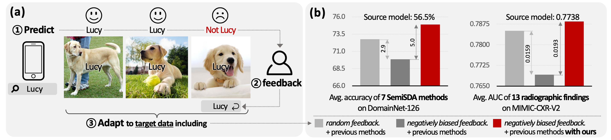

# RLD-SemiSDA

Official PyTorch implementation of "Is user feedback always informative? Retrieval Latent Defending for Semi-Supervised Domain Adaptation without Source Data" (ECCV 2024)

<div align="center">
  
  <div>&nbsp;</div>

[](https://arxiv.org/abs/2407.15383) [](https://sites.google.com/view/junha/nbf-rld)
</div>

## Overview

This repository contains the implementation of our semi-supervised domain adaptation method that addresses the challenge of biased user feedback in medical image analysis.

## Implementation

#### Chest X-ray Experiments
The chest X-ray experiments implementation is available in the `Chest-X-ray` directory. Please refer to [Chest-X-ray/README.md](Chest-X-ray/README.md) for detailed instructions on:
- Dataset preparation
- Model training
- Adaptation experiments

#### Image Classification
The implementation for general image classification tasks is available in the `Classification` directory. Please refer to [Classification/README.md](Classification/README.md) for detailed instructions on:
- Installation and environment setup
- Dataset preparation (Office-Home and DomainNet)
- Pre-training source models
- Running adaptation experiments with:
  - Random Feedback (RF)
  - Negatively Biased Feedback (NBF)
  - NBF with Retrieval Latent Defending (RLD)

## Citation

If you find this work interesting and useful, please cite our paper:

```bibtex
@inproceedings{song2024nbfrld,
  title={Is user feedback always informative? Retrieval Latent Defending for Semi-Supervised Domain Adaptation without Source Data},
  author={Junha Song and Tae Soo Kim and Junha Kim and Gunhee Nam and Thijs Kooi and Jaegul Choo},
  booktitle={The European Conference on Computer Vision (ECCV)},
  year={2024}
}
```